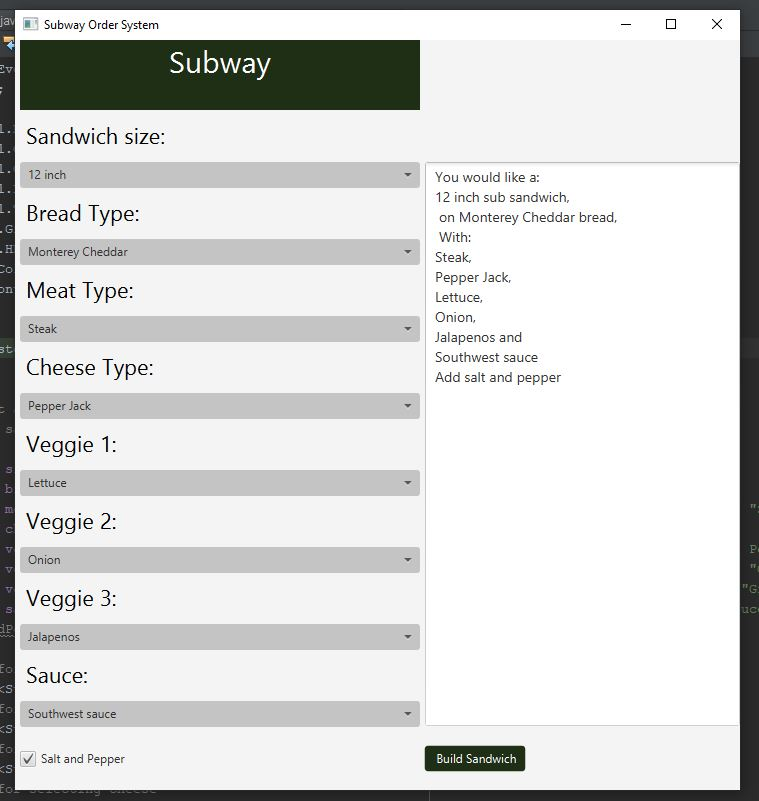

Week 13 Group: Group Project

This program creates a Subway sandwich ordering system using JavaFX components

## Example Output

This image will display as your example output. Name the image README.JPG in your project folder.

## Analysis Steps

Reflecting back on past JavaFX projects, I reviewed their behavior and picked through the different components
to achieve a single page ordering system.

### Design

1) We started with creating the different arrays that would hold the ingredient choices for the user to 
choose in the building of their sandwich.
2) We created the different combo boxes and text area that would hold the ingredients and the output
of the final sandwich.
3) Inside the start method, we created the different labels for each combo box and assigned the desired styling.
4) We created an HBox to hold and position the page header.
5) We then created a GridPane that would hold the remainder of the GUI.
6) At that point, we placed the labels and the ingredient arrays inside the GridPane in their repective grid positions
and applied the desired styling.
7) Then we created, styled, and added the button that would submit the choices of the user.
8) We then created and added a CheckBox that would take in the boolean value for salt and pepper. 
9) Then, we created an instance of the ObservableList type, an arraylist that would hold the ingredient arrays.
10) Then, we created the ActionEvent that would take in the values selected by the user and concatenate them
into a string and place the string into the TextArea.

### Testing

For the testing of this program, I merely made numerous types of sandwiches using different
toppings testing the output of the values.

## Do not change content below this line
## Adapted from a README Built With

* [Dropwizard](http://www.dropwizard.io/1.0.2/docs/) - The web framework used
* [Maven](https://maven.apache.org/) - Dependency Management
* [ROME](https://rometools.github.io/rome/) - Used to generate RSS Feeds

## Contributing

Please read [CONTRIBUTING.md](https://gist.github.com/PurpleBooth/b24679402957c63ec426) for details on our code of conduct, and the process for submitting pull requests to us.

## Versioning

We use [SemVer](http://semver.org/) for versioning. For the versions available, see the [tags on this repository](https://github.com/your/project/tags). 

## Authors

* **Billie Thompson** - *Initial work* - [PurpleBooth](https://github.com/PurpleBooth)

See also the list of [contributors](https://github.com/your/project/contributors) who participated in this project.

## License

This project is licensed under the MIT License - see the [LICENSE.md](LICENSE.md) file for details

## Acknowledgments

* Hat tip to anyone who's code was used
* Inspiration
* etc
