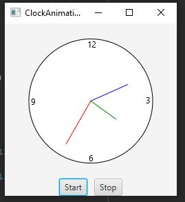

# Week05Assign:Exercise 15.32 Control Clock

Created a clock with animation and two buttons to control it.

## Example Output

This image will display as your example output. Name the image README.JPG in your project folder.

## Analysis Steps

Having been exposed to a similar clock program in Chapter 14, and even more recent a project in Chapter 15 
which animated the clock design from Chapter 14, my analysis consisted of studying the past two programs and
determining the changes required to add the necessary nodes and EventHanlder to get the desired output.

### Design

1) I utilized the ClockAnimation and ClockPane programs that were examples in the current and previous chapter.
2) Once I got the ClockPane program animated, I then set out to create controls that would let me start and stop
the animation.
3) Since the assignment required that buttons be used, I knew I had to modify the ClockAnimation program placing
the clock inside of an HBox so that I would be able to add and position the buttons.
4) Based on previous examples, I knew that an HBox with button controls would work well with a BorderPane. So I
placed the clock inside of a BorderPane and placed the BorderPane above the HBox.
5) I then set the action for both of the buttons.

### Testing

For this program, there was primarily three phases of testing. 
First: Was when I created the ClockPane program. My main test was to make sure that when I ran the program it 
was giving the correct current time.
Second: Was when I animated the clock. My main test was making sure that it was updating and repainting the clock 
for every second.
Third: Was when I placed the two buttons into the program. I verified that the buttons were place where I wanted
them. And then I verified that the EventHandler was working correctly starting and stopping the clock. 

## Notes

Explain any issues or testing instructions.

## Do not change content below this line
## Adapted from a README Built With

* [Dropwizard](http://www.dropwizard.io/1.0.2/docs/) - The web framework used
* [Maven](https://maven.apache.org/) - Dependency Management
* [ROME](https://rometools.github.io/rome/) - Used to generate RSS Feeds

## Contributing

Please read [CONTRIBUTING.md](https://gist.github.com/PurpleBooth/b24679402957c63ec426) for details on our code of conduct, and the process for submitting pull requests to us.

## Versioning

We use [SemVer](http://semver.org/) for versioning. For the versions available, see the [tags on this repository](https://github.com/your/project/tags). 

## Authors

* **Billie Thompson** - *Initial work* - [PurpleBooth](https://github.com/PurpleBooth)

See also the list of [contributors](https://github.com/your/project/contributors) who participated in this project.

## License

This project is licensed under the MIT License - see the [LICENSE.md](LICENSE.md) file for details

## Acknowledgments

* Hat tip to anyone who's code was used
* Inspiration
* etc
