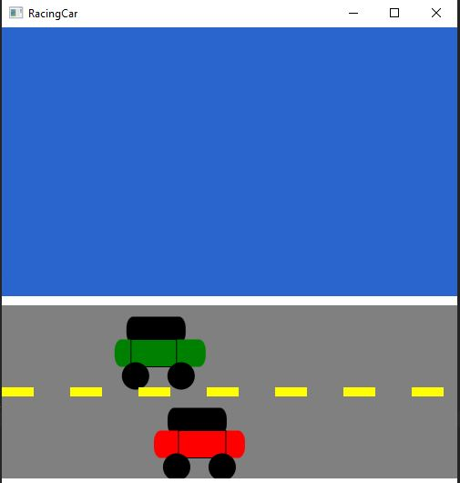

Week05 Assign: Exercise 15.29 Racing Car

One Paragraph of project description goes here

Two lane road with two animated cars

This image will display as your example output. Name the image README.JPG in your project folder.



## Analysis Steps

The goal for this project was to create a car using multiple shapes and to animate
the car using the libraries and techniques learned in Chapter 15 of the book. I 
started by reviewing practice programs that utilized the functions that I would 
need. I then combined the different animation techniques and controls to make my
racing car program.

### Design

1) I started by creating the rising flag program, but made the flag move horizontally
instead of vertically. 
2) Once I was able to get the flag to move at the rate and on the desired line, I
then created the horizontal lines that would serve as the road.
3) I then moved onto creating, positioning, and setting the properties of the shapes
that would become the first car.
4) Once I finished the first car, I set out to replace the flag image with the first
car that I had formed. After some trial and error with positioning, the first car
moved as desired. 
5) The first car seemed a little lonely, so I added a second car going the opposite
direction.
6) I then set out to set the controls. I started with the pause/play using the click
of the mouse. That went fairly smoothly.
7) Next I set the button ActionEvents and remembered after banging my head for 
awhile to utilize the .requestFocus() method.
8) Then completed the final steps of creating the scene, placing the scene in the
stage, setting the title and showing the stage.

```
Give examples
```

### Testing

For the testing, I tested throughout the design process. For the final testing I
ran the program and tested the MouseClick event on each car and it was successful.
I then tried out the ButtonClick event which unfortunately only worked for the 
primary car. Over all it was a success. 

## Notes

Explain any issues or testing instructions.

## Do not change content below this line
## Adapted from a README Built With

* [Dropwizard](http://www.dropwizard.io/1.0.2/docs/) - The web framework used
* [Maven](https://maven.apache.org/) - Dependency Management
* [ROME](https://rometools.github.io/rome/) - Used to generate RSS Feeds

## Contributing

Please read [CONTRIBUTING.md](https://gist.github.com/PurpleBooth/b24679402957c63ec426) for details on our code of conduct, and the process for submitting pull requests to us.

## Versioning

We use [SemVer](http://semver.org/) for versioning. For the versions available, see the [tags on this repository](https://github.com/your/project/tags). 

## Authors

* **Billie Thompson** - *Initial work* - [PurpleBooth](https://github.com/PurpleBooth)

See also the list of [contributors](https://github.com/your/project/contributors) who participated in this project.

## License

This project is licensed under the MIT License - see the [LICENSE.md](LICENSE.md) file for details

## Acknowledgments

* Hat tip to anyone who's code was used
* Inspiration
* etc
