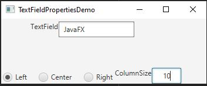

Week06Assign:Exercise 16.6 Demonstrate TextField Properties

This program created two text fields and three radio buttons that controls the
size of one of the text fields and the text within it.

## Example Output

This image will display as your example output. Name the image README.JPG in your project folder.

## Analysis Steps

To create the multiple javafx controls, I referred back to the many book practice
programs. There were quite a few to choose from that helped to create a starting
point. I then modified my code one step at a time starting with the top text field.
Creating the controls and positioning them was tricky. I then, once the controls 
in place set out to make them functional.

### Design

For this program I used only the main class. 
1) I created a getPane() method that I had done in a previous program. That way I could
build the entire program and display it in one pane.
2) Then I created the TextField that would take in the users input.
3) I then created an HBox and created a label for and imported the first text field
and set their properties.
4) Then I created an HBox to hold the three radio buttons and set the pane properties.
5) I then created, labeled, positioned, and inserted the three radio buttons and 
placed them inside the pane.
6) I then used a ToggleGroup to group the radio buttons making them dependant upon
one another.
7) I then created the second text field and followed the same step as the first,
except I included the radio buttons as well as the label and text field.
8) Having the layout finished, I then created the ActionEvent for the column size
text field.
9) Then I moved on to making the radio buttons functional.
10) I returned the pane from the getPane() method.
11) I then invoked the getPane() method inside the stage and set the layout properties.
12) Then wrapped up giving the stage a title, setting the scene, and showing the 
stage. 

### Testing

For testing this program, I typed some text into the first TextField and tested
that the radio buttons correctly repositioned the text as desired. I also tested
the column size TextField making sure the first TextField was adjusted when the 
value was changed.

## Notes

Explain any issues or testing instructions.

## Do not change content below this line
## Adapted from a README Built With

* [Dropwizard](http://www.dropwizard.io/1.0.2/docs/) - The web framework used
* [Maven](https://maven.apache.org/) - Dependency Management
* [ROME](https://rometools.github.io/rome/) - Used to generate RSS Feeds

## Contributing

Please read [CONTRIBUTING.md](https://gist.github.com/PurpleBooth/b24679402957c63ec426) for details on our code of conduct, and the process for submitting pull requests to us.

## Versioning

We use [SemVer](http://semver.org/) for versioning. For the versions available, see the [tags on this repository](https://github.com/your/project/tags). 

## Authors

* **Billie Thompson** - *Initial work* - [PurpleBooth](https://github.com/PurpleBooth)

See also the list of [contributors](https://github.com/your/project/contributors) who participated in this project.

## License

This project is licensed under the MIT License - see the [LICENSE.md](LICENSE.md) file for details

## Acknowledgments

* Hat tip to anyone who's code was used
* Inspiration
* etc
