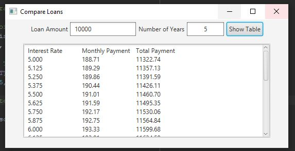

Week07 Assign: Exercise 16.13 Compare Loans w/ Various Interest Rates

This program creates two TextFields w/ Labels, a Button, and a TextArea that
will take in the users LoanAmount and NumberOfYears and upon the Button click
it will display inside the TextArea the interest rates ranging from 5-8 percent
incrementing by .125 percent, the monthlyPayment and the totalPayment each 
iteration.

## Example Output

This image will display as your example output. Name the image README.JPG in your project folder.

## Analysis Steps

To create the multiple javafx controls, I referred back to the many book practice
programs. There were quite a few to choose from that helped to create a starting
point. I then modified my code one step at a time starting with the top text fields.
Creating the controls and positioning them followed the last assignment closely 
with an addition of the TextArea and ScrollPane. For me the most complicated part
was figuring out the ActionEvent and the Formatting of the output.

### Design

For this program I used only the main class. 
1) First, I created two TextFields and Labels that would take in the users input.
2) Then, I created the Button that would trigger the ActionEvent to calculate the
loan information.
3) I then created an HBox and placed the two TextFields and Button inside.
4) Then, I created the ScrollPane and the TextArea that would hold the loan calculations.
4) Then I created an HBox to hold the SP and TA.
5) I then created a VBox to hold the two HBox layouts and their contents.
6) At this point I created the ActionEvent for the button click. Due to the complexity
of the functions within, I chose not to use the lambda expression. 
7) Create necessary variable to hold the calculated and interated values and calculate
them according to the provided equation in the LoanCalculator program in the book.
8) Format and concatenate the appropriate string for the output for each iteration.
9) Then wrapped up giving the stage a title, setting the scene, and showing the 
stage.

### Testing

As with other programs, I tested this program throughout the development for positioning.
As for the functionality, I ran different loan amounts and years through the UI to
verify the correct figures.

## Notes

Explain any issues or testing instructions.

## Do not change content below this line
## Adapted from a README Built With

* [Dropwizard](http://www.dropwizard.io/1.0.2/docs/) - The web framework used
* [Maven](https://maven.apache.org/) - Dependency Management
* [ROME](https://rometools.github.io/rome/) - Used to generate RSS Feeds

## Contributing

Please read [CONTRIBUTING.md](https://gist.github.com/PurpleBooth/b24679402957c63ec426) for details on our code of conduct, and the process for submitting pull requests to us.

## Versioning

We use [SemVer](http://semver.org/) for versioning. For the versions available, see the [tags on this repository](https://github.com/your/project/tags). 

## Authors

* **Billie Thompson** - *Initial work* - [PurpleBooth](https://github.com/PurpleBooth)

See also the list of [contributors](https://github.com/your/project/contributors) who participated in this project.

## License

This project is licensed under the MIT License - see the [LICENSE.md](LICENSE.md) file for details

## Acknowledgments

* Hat tip to anyone who's code was used
* Inspiration
* etc
