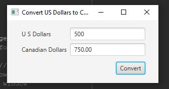

Week08 Exam: Unit2 HandsOn

This program will take in an amount of US dollars from the user and convert
it to the Canadian dollar equivalent

## Example Output

This image will display as your example output. Name the image README.JPG in your project folder.

## Analysis Steps

To create the multiple javafx controls, I referred back to the many book practice
programs. There were quite a few to choose from that helped to create a starting
point. Once the layout was created, I made the button functional/disfunctional
for specific input ultimately creating a method to calculate the input.

### Design

I created a separate class for the Alert and used the main for the UI

1) I started by creating two TextFields and making them final so that I could use 
them in the inner method later.
2) Then, I created a GridPane and set the positioning, padding, and gaps for the 
children that would be placed inside.
3) I then created the two Labels for the TextFields
4) Then, I added Labels, TextFields, and the Button to the GridPane
5) After much research, I created a KeyClickedListener that would eliminate the 
input from any key other than 0-9
6) Then, I skipped to the bottom and created the getDollars method that would take
in the input the user typed in the US Dollars TextField and multiply it by 1.5 to 
get its Canadian Dollar equivalent if it was greater than zero. Otherwise it would
throw an Alert.
7) I then researched and wrote a separate class for the Alert so that it could be 
reused by other programs.
8) Then wrapped up giving the stage a title, setting the scene, and showing the 
stage.

### Testing

For the testing of this program, I verified that the KeyClickEvent was working by
trying to type in letters and special characters and it would not allow it. I then 
typed in the number zero into the US Dollars TextField and it threw the Alert. I then
typed multiple different amounts and checked the calculations. It worked well.

## Do not change content below this line
## Adapted from a README Built With

* [Dropwizard](http://www.dropwizard.io/1.0.2/docs/) - The web framework used
* [Maven](https://maven.apache.org/) - Dependency Management
* [ROME](https://rometools.github.io/rome/) - Used to generate RSS Feeds

## Contributing

Please read [CONTRIBUTING.md](https://gist.github.com/PurpleBooth/b24679402957c63ec426) for details on our code of conduct, and the process for submitting pull requests to us.

## Versioning

We use [SemVer](http://semver.org/) for versioning. For the versions available, see the [tags on this repository](https://github.com/your/project/tags). 

## Authors

* **Billie Thompson** - *Initial work* - [PurpleBooth](https://github.com/PurpleBooth)

See also the list of [contributors](https://github.com/your/project/contributors) who participated in this project.

## License

This project is licensed under the MIT License - see the [LICENSE.md](LICENSE.md) file for details

## Acknowledgments

* Hat tip to anyone who's code was used
* Inspiration
* etc
