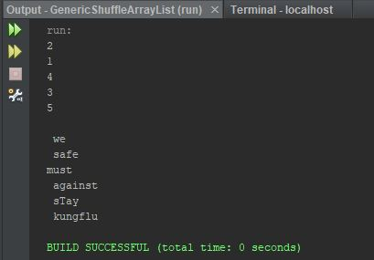

Assignment: Week 09 Assign: Exercise 19.8 Shuffle ArrayList

This program takes values from an ArrayList and shuffles them randomly using the 
Math.random method.

## Example Output

This image will display as your example output. Name the image README.JPG in your project folder.

## Analysis Steps

The goal was to use generics to create a method that would shuffle the values from 
one/many ArrayLists. For analysis I reviewed the different practice programs in 
the book and Googled the different approaches used to shuffle an ArrayList vs an array.

### Design

1) I started off by researching the use of and format of ArrayLists using generics.
2) I then created two ArrayLists using different wrapper classes to be shuffled.
3) Then I filled the ArrayLists with values.
4) Per the assignment instructions, I utitilized the provided method header.
5) I then, through much research online, created a for loop utilizing the size and
get methods for retrieving the data from the ArrayList that was to be used in the loop.
6) Using a variable to store the value, I used the Math.random method to take in the 
current index and multiplying it by a random index based on the size of the ArrayList.
7) Then using a second variable, I stored the current index value.
8) This method shuffled through the ArrayList until each index was set.
9) Then I created a printList method that would take in the results of the ArrayList
and print them one line at a time.

### Testing

To test this program I created two ArrayList with wrapper classes and coded different
values. I then used the two methods created to verify that the data was being shuffled
and printed correctly. 

## Do not change content below this line
## Adapted from a README Built With

* [Dropwizard](http://www.dropwizard.io/1.0.2/docs/) - The web framework used
* [Maven](https://maven.apache.org/) - Dependency Management
* [ROME](https://rometools.github.io/rome/) - Used to generate RSS Feeds

## Contributing

Please read [CONTRIBUTING.md](https://gist.github.com/PurpleBooth/b24679402957c63ec426) for details on our code of conduct, and the process for submitting pull requests to us.

## Versioning

We use [SemVer](http://semver.org/) for versioning. For the versions available, see the [tags on this repository](https://github.com/your/project/tags). 

## Authors

* **Billie Thompson** - *Initial work* - [PurpleBooth](https://github.com/PurpleBooth)

See also the list of [contributors](https://github.com/your/project/contributors) who participated in this project.

## License

This project is licensed under the MIT License - see the [LICENSE.md](LICENSE.md) file for details

## Acknowledgments

* Hat tip to anyone who's code was used
* Inspiration
* etc
