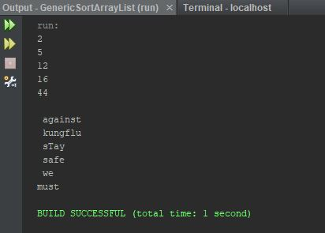

Assignment: Week 09 Assign: Exercise 19.9 Sort ArrayList

This program takes values from an ArrayList and sorts them in ascending order.

## Example Output

This image will display as your example output. Name the image README.JPG in your project folder.

## Analysis Steps

The goal was to use generics to create a method that would sort the values from 
one/many ArrayLists. For analysis I reviewed the different practice programs in 
the book and Googled the different approaches used to sort an ArrayList vs an array.

### Design

1) For the bones of this program I studied the GenericSort program in the book that
used a generic method to sort multiple arrays with different data types.
2) Using the basic layout, I changed the method header to meet the assignment requirements.
3) I then modified the arrays, changing them to ArrayLists with generic wrapper classes.
4) Then I modified the sort method primarily changing the parameters that the method
was to take in.
5) I then, through much research online, changed the for loops utilizing the size and
get methods for retrieving the data from the ArrayList that was to be used in the loops
6) Using the data retrieved from the loops, two variables were set based on the loop requirements
7) I then used an if statement comparing currentMinIndex to the currentMin swapping them
if necessary
8) Then I created a printList method that would take in the results of the ArrayList
and print them one line at a time.

### Testing

To test this program I created two ArrayList with wrapper classes and coded different
values. I then used the two methods created to verify that the data was being sorted
and printed correctly. 

## Do not change content below this line
## Adapted from a README Built With

* [Dropwizard](http://www.dropwizard.io/1.0.2/docs/) - The web framework used
* [Maven](https://maven.apache.org/) - Dependency Management
* [ROME](https://rometools.github.io/rome/) - Used to generate RSS Feeds

## Contributing

Please read [CONTRIBUTING.md](https://gist.github.com/PurpleBooth/b24679402957c63ec426) for details on our code of conduct, and the process for submitting pull requests to us.

## Versioning

We use [SemVer](http://semver.org/) for versioning. For the versions available, see the [tags on this repository](https://github.com/your/project/tags). 

## Authors

* **Billie Thompson** - *Initial work* - [PurpleBooth](https://github.com/PurpleBooth)

See also the list of [contributors](https://github.com/your/project/contributors) who participated in this project.

## License

This project is licensed under the MIT License - see the [LICENSE.md](LICENSE.md) file for details

## Acknowledgments

* Hat tip to anyone who's code was used
* Inspiration
* etc
