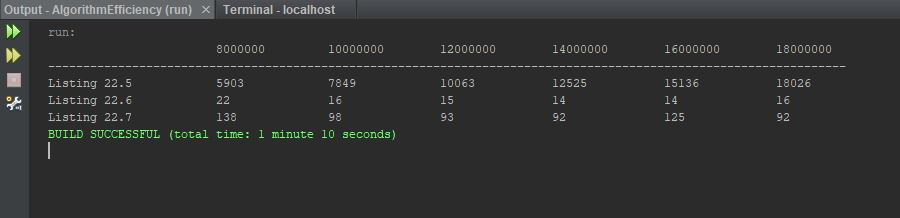

Week10Assign: Exercise 22_14 Execution time for prime numbers

This program is supposed to take three algorithms for finding prime numbers and compare
their efficiency.

## Example Output

This image will display as your example output. Name the image README.JPG in your project folder.

## Analysis Steps

Write a program that obtains the execution time for finding all the prime numbers less than 8,000,000, 
10,000,000, 12,000,000, 14,000,000, 16,000,000, and 18,000,000 using the algorithms in Listings 22.5-22.7.
My analysis of the requirements for this program consisted of watching videos, reading the chapter, and networking
on Discord. I was stretched beyond my understanding on this program and tried to duplicate the desired output, but 
don't believe the output is accurate. :( 

### Design

1) I started by creating an array of long type to hold the execution times.
2) Then, I created a couple of print lines to format the desired table to hold the results.
3) For each listing (22.5 - 22.7), I used a for loop that takes the start time, calls the respective
method, records the execution time, and subtracts the start time from the execution time.
4) Then, I  created three methods, one for each listing, and used the logic provided in the book for each
to find the prime numbers using different values.

### Testing

## Notes
I was very confused by the information in Chapter 22. I read and re-read the chapter and struggled to 
understand the concepts of algorithm efficiency. For this assignment, I am certain that the output is not
what was expected. :(

Explain any issues or testing instructions.
## Do not change content below this line
## Adapted from a README Built With

* [Dropwizard](http://www.dropwizard.io/1.0.2/docs/) - The web framework used
* [Maven](https://maven.apache.org/) - Dependency Management
* [ROME](https://rometools.github.io/rome/) - Used to generate RSS Feeds

## Contributing

Please read [CONTRIBUTING.md](https://gist.github.com/PurpleBooth/b24679402957c63ec426) for details on our code of conduct, and the process for submitting pull requests to us.

## Versioning

We use [SemVer](http://semver.org/) for versioning. For the versions available, see the [tags on this repository](https://github.com/your/project/tags). 

## Authors

* **Billie Thompson** - *Initial work* - [PurpleBooth](https://github.com/PurpleBooth)

See also the list of [contributors](https://github.com/your/project/contributors) who participated in this project.

## License

This project is licensed under the MIT License - see the [LICENSE.md](LICENSE.md) file for details

## Acknowledgments

* Hat tip to anyone who's code was used
* Inspiration
* etc
