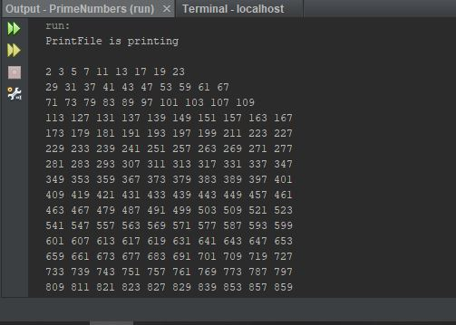

Week10Assign:Exercise22.8 All prime numbers up to

This program will list all prime numbers up to a given amount. It will store the numbers
in increments of 10,000 into a data file for comparison of each new number, until the file 
has stored all of the prime numbers up to the given amount.

## Example Output

This image will display as your example output. Name the image README.JPG in your project folder.

## Analysis Steps

The goal of this assignment was to write a program that would list all prime numbers
up to a given number. The prime numbers were to be stored in an array of 10,000 indexes,
inside a data file, that would be used to compare each new prime number against.
In the spirit of transparency, I struggled a bit with exactly how to do this entire program.
The book had a really good sample program for find all prime number up to a specific number
as well as how to write data to a file. Putting it all together was tricky and the videos
posted in Canvas were my saving grace.
### Design

1) Started by creating a final int array of 10000 indexes for file storage.
2) Then we created a final variable of long type to take in the desired number to which
we would find the prime numbers to.
3) At that point we created an array of long type set to the final int array above to 
hold the 10000 prime numbers per batch.
4) We then created a variable of long type to hold the current number to be tested for primeness.
5) Then we created an instance of the RandomAccessFile naming it and making it read/writable.
6) We then created an if statement that would check if there were previous data saved to the
file or if we were starting from 0.
7) Then we created a method that would take in the array of 10000 numbers at its current
size and the RandomAccessFile, compare the current file pointer position to the file size
and if the pointer had not reached the end of the file it would then compare it to the 
final int array of 10000 and if the file pointer was less than both, it would increment the
array index and add the current prime number to the array in the file with the proper exception handling
in place.
8) Then we created a variable for squareRoot that would be used to determine a numbers primeness 
and be incremented as necessary.
9) We then created a labeled while loop that would increment the number being tested, use the seek method
to get current file pointer, check and increment the squareRoot if necessary, compare the file pointer 
against the file length and move to a new batch as necessary, determine primeness, and append the 
new number to the file if prime.
10)    

### Testing

For testing of the program (primarily the data file), we created a TestFile program that
formats the file to take ten numbers per line, takes in a specified file, makes sure the file
is not empty and that the file exists, and prints the sum, count, and context of the file 
with the appropriate exception handling.

## Do not change content below this line
## Adapted from a README Built With

* [Dropwizard](http://www.dropwizard.io/1.0.2/docs/) - The web framework used
* [Maven](https://maven.apache.org/) - Dependency Management
* [ROME](https://rometools.github.io/rome/) - Used to generate RSS Feeds

## Contributing

Please read [CONTRIBUTING.md](https://gist.github.com/PurpleBooth/b24679402957c63ec426) for details on our code of conduct, and the process for submitting pull requests to us.

## Versioning

We use [SemVer](http://semver.org/) for versioning. For the versions available, see the [tags on this repository](https://github.com/your/project/tags). 

## Authors

* **Billie Thompson** - *Initial work* - [PurpleBooth](https://github.com/PurpleBooth)

See also the list of [contributors](https://github.com/your/project/contributors) who participated in this project.

## License

This project is licensed under the MIT License - see the [LICENSE.md](LICENSE.md) file for details

## Acknowledgments

* Hat tip to anyone who's code was used
* Inspiration
* etc
