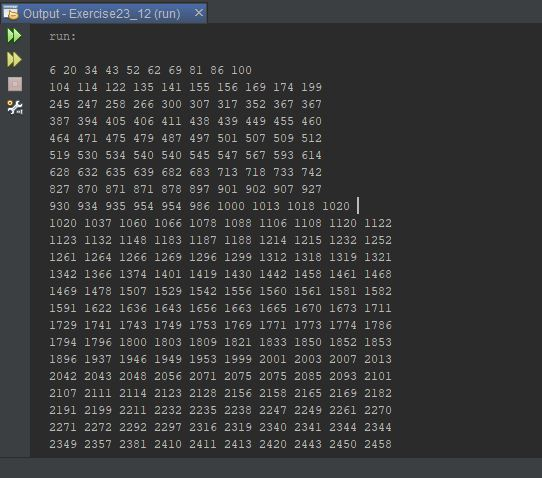

Assignment: Week 11 Assign: Exercise 23.12 Radix Sort

This program creates an array list of one million random numbers
and uses the radix sort to sort the number in ascending order.

## Example Output

This image will display as your example output. Name the image README.JPG in your project folder.

## Analysis Steps

This program requested that an array be populated with one million numbers and that the radix sort
be utilized to sort the numbers in ascending order. I analyzed this program by studying both the 
bucket sort and radix sort methods in the book and Googled the topic and read in depth.

### Design

Thanks to the book and some online resources, I was able to find some program examples to help get
me started.

1) I started by creating a final variable to be used to format the program output (this was also used in the previous program assignment).
2) I then created the necessary instance variables for the formatting as well.
3) Then I created an array that had a capacity of one million to hold the numbers to be sorted.
4) Using the Math.random method, I generated one million random numbers from 1 to 10,000,000.
5) Then I created the radSort method that would determine the number of digits in the largest value in the array, determing the current
position and sort each number into respective buckets based on the that position, and return those numbers back to the list after each 
complete iteration through the array to be sorted again until the entire array had been sorted through all of the buckets.
6) I then used a for loop to print ten numbers on each line, creating a new line after ten had be printed.

### Testing

To test this program, I reduced the capacity of the array to one thousand and ran it multiple time using 
different values to check for sorting accuracy.

## Do not change content below this line
## Adapted from a README Built With

* [Dropwizard](http://www.dropwizard.io/1.0.2/docs/) - The web framework used
* [Maven](https://maven.apache.org/) - Dependency Management
* [ROME](https://rometools.github.io/rome/) - Used to generate RSS Feeds

## Contributing

Please read [CONTRIBUTING.md](https://gist.github.com/PurpleBooth/b24679402957c63ec426) for details on our code of conduct, and the process for submitting pull requests to us.

## Versioning

We use [SemVer](http://semver.org/) for versioning. For the versions available, see the [tags on this repository](https://github.com/your/project/tags). 

## Authors

* **Billie Thompson** - *Initial work* - [PurpleBooth](https://github.com/PurpleBooth)

See also the list of [contributors](https://github.com/your/project/contributors) who participated in this project.

## License

This project is licensed under the MIT License - see the [LICENSE.md](LICENSE.md) file for details

## Acknowledgments

* Hat tip to anyone who's code was used
* Inspiration
* etc
