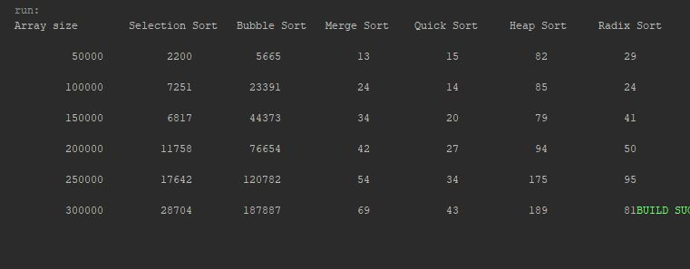

Week12 Exam: Unit 3 Hands-On

This program creates 6 different array lists that start at a capacity of 50,000 and increment after each iteration by 50,000
until reaching a capacity of 300,000. For each array list the values generated are randomized from 0 - 1,000,000. Once the 
array list has been filled, the program performs the selection, bubble, merge, quick, heap, and radix sort. The execution time
of each sort is recorded into a table.

## Example Output

This image will display as your example output. Name the image README.JPG in your project folder.

## Analysis Steps

For my analysis of this program, I used the algorithms provided in the book, formatting from the
most recent radix sort assignment, logic from the prime numbers execution time assignment, and plenty
of online help. I put many things together to get what you see.

### Design

1) I started by creating the output lines to create the columns and rows of the table.
2) I used a for loop that called the printValue method for each iteration that would create and array,
copy the array, run each sort algorithm, and print the execution time for each up to a specified capacity.
3) Each iteration called the related method (algorithm) provided by the book.

### Testing

For the testing, I ran a 100 capacity array through each sort algorithm to confirm proper sorting. Once the
smaller array sorted correctly for each algorithm, I increased the capacity to meet the requirements of the 
assignment.

## Do not change content below this line
## Adapted from a README Built With

* [Dropwizard](http://www.dropwizard.io/1.0.2/docs/) - The web framework used
* [Maven](https://maven.apache.org/) - Dependency Management
* [ROME](https://rometools.github.io/rome/) - Used to generate RSS Feeds

## Contributing

Please read [CONTRIBUTING.md](https://gist.github.com/PurpleBooth/b24679402957c63ec426) for details on our code of conduct, and the process for submitting pull requests to us.

## Versioning

We use [SemVer](http://semver.org/) for versioning. For the versions available, see the [tags on this repository](https://github.com/your/project/tags). 

## Authors

* **Billie Thompson** - *Initial work* - [PurpleBooth](https://github.com/PurpleBooth)

See also the list of [contributors](https://github.com/your/project/contributors) who participated in this project.

## License

This project is licensed under the MIT License - see the [LICENSE.md](LICENSE.md) file for details

## Acknowledgments

* Hat tip to anyone who's code was used
* Inspiration
* etc
