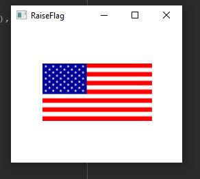

Week 13 Assign: Exercise 30.3 Raise Flags

This program uses a thread to run 15.3 Flag Rising Animation

## Example Output

This image will display as your example output. Name the image README.JPG in your project folder.



## Analysis Steps

The goal was to take an animation originally written using Java FX path transition to run an animation
and to modify it to use a thread to achieve the same animation.

### Design

For this program, I used the pre-existing code for the FlagRisingAnimation and placed the path transition
inside of the run method using a thread.
```
Give examples
```

For this program, I was not exactly sure how to test the output, so once I got the program to run using
a thread I assumed it successful. :) 

## Do not change content below this line
## Adapted from a README Built With

* [Dropwizard](http://www.dropwizard.io/1.0.2/docs/) - The web framework used
* [Maven](https://maven.apache.org/) - Dependency Management
* [ROME](https://rometools.github.io/rome/) - Used to generate RSS Feeds

## Contributing

Please read [CONTRIBUTING.md](https://gist.github.com/PurpleBooth/b24679402957c63ec426) for details on our code of conduct, and the process for submitting pull requests to us.

## Versioning

We use [SemVer](http://semver.org/) for versioning. For the versions available, see the [tags on this repository](https://github.com/your/project/tags). 

## Authors

* **Billie Thompson** - *Initial work* - [PurpleBooth](https://github.com/PurpleBooth)

See also the list of [contributors](https://github.com/your/project/contributors) who participated in this project.

## License

This project is licensed under the MIT License - see the [LICENSE.md](LICENSE.md) file for details

## Acknowledgments

* Hat tip to anyone who's code was used
* Inspiration
* etc
