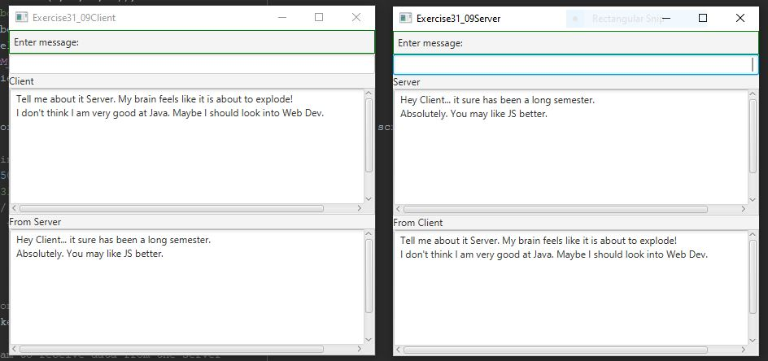

Week 14 Assign: Exercise 31.9 Chat

This program creates two threads and utilizes Sockets and DataInputStreams and DataOutputStreams
to allow threads to run in parallel in a chat format.

## Example Output

This image will display as your example output. Name the image README.JPG in your project folder.



## Analysis Steps

In order to create the Client/Server chat threads, I utilized the individual Client and Server
programs from the book and made the necessary modifications to meet the requirements of this 
assignment.

### Design

1) I started by creating the necessary GUI components and getting them positioned correctly.
2) I then created and wrapped the code in a thread that would start by creating a socket that would request a connection
 to the server.
3) Then I created an Input/Output stream for sending and receiving data from the server.
4) Then I placed an ActionEvent inside of a while loop that would always be true so that the
thread would always be listening for activity.
5) Then I took the text from the text field and sent it via the Output stream to the server
6) I then took the same input that was sent to the server and printed it to the corresponding
text area box on the client side.
7) Then I wrote the code that would receive through the Input stream the input from the server.
8) Finally the thread was started.   

```
Give examples
```

### Testing

For the testing I sat and had a long chat with myself verifying that the thread was always ready
and listening for new input and that the input was being printed to the correct text areas.

## Do not change content below this line
## Adapted from a README Built With

* [Dropwizard](http://www.dropwizard.io/1.0.2/docs/) - The web framework used
* [Maven](https://maven.apache.org/) - Dependency Management
* [ROME](https://rometools.github.io/rome/) - Used to generate RSS Feeds

## Contributing

Please read [CONTRIBUTING.md](https://gist.github.com/PurpleBooth/b24679402957c63ec426) for details on our code of conduct, and the process for submitting pull requests to us.

## Versioning

We use [SemVer](http://semver.org/) for versioning. For the versions available, see the [tags on this repository](https://github.com/your/project/tags). 

## Authors

* **Billie Thompson** - *Initial work* - [PurpleBooth](https://github.com/PurpleBooth)

See also the list of [contributors](https://github.com/your/project/contributors) who participated in this project.

## License

This project is licensed under the MIT License - see the [LICENSE.md](LICENSE.md) file for details

## Acknowledgments

* Hat tip to anyone who's code was used
* Inspiration
* etc
