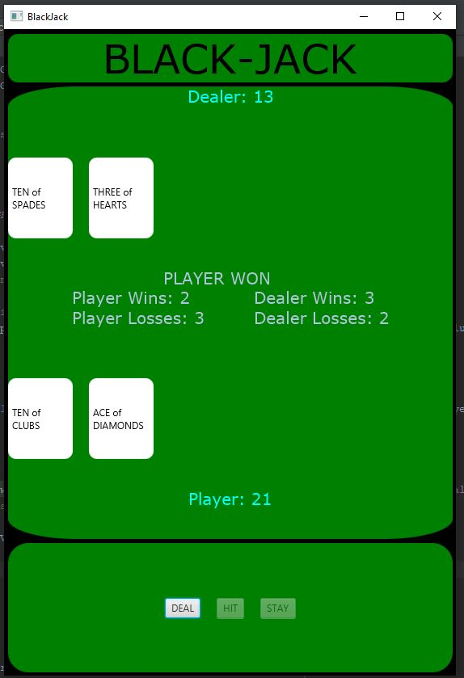

Final Project: Black Jack

This program simulates the game of BlackJack. Upon being dealt two cards each, the player and
the dealer take as many cards as they wish trying to get 21. If you go over, you bust.

## Example Output

This image will display as your example output. Name the image README.JPG in your project folder.

## Analysis Steps

To analyze this assignment, I skimmed back through multiple chapters of the book, mostly
the JavaFX chapters. I also utilized online resources to help with the breakdown of needed
classes for such a program.

### Design

My approach to this assignment (originally) got me really close to a functional BlackJack program.
There were a few errors in my code that no matter how much I tried, they would not allow the program 
to render correctly and the logic was off. That lead me to research other project like this one. Upon
researching many options, I was able to create a template and then start modifying the logic from there.

1) I started with thinking about the design of the cards and created the Card class.
2) I then thought about the number of cards required and the function of the cards during 
a game and created the Deck class with the refill and draw methods.
3) After that, I created the Hand class that would take in the Card class and assign values and a method
to sum those value during a game.
4) Then I looked up BlackJack tables online and thought about the layout of the GUI.
5) I then layed out the Panes, VBoxes, HBoxes, Text, and other components of the GUI until the desired
appearance was achieved.
6) I then imported the Card, Deck, and Hand classes and started implementing the methods provided and 
created the startNewGame and endGame methods that would control the game.

Note: My code can be extremely crude, but functional. I followed many different coding examples to make my 
code more elegant for this assignment.  

### Testing

For testing, I played numerous games of BlackJack testing the output for the multiple different potential
end scenarios. For the most part, the game worked as I intended. See notes for exception.

## Notes

There was one bug that I ran out of time and was unable to fix. If the dealer busts and the player does not,
it will increment the players score by two. Also, if the dealer wins with 21 it will increment the dealer score by
two. Other than that, it is all GOOD!

## Do not change content below this line
## Adapted from a README Built With

* [Dropwizard](http://www.dropwizard.io/1.0.2/docs/) - The web framework used
* [Maven](https://maven.apache.org/) - Dependency Management
* [ROME](https://rometools.github.io/rome/) - Used to generate RSS Feeds

## Contributing

Please read [CONTRIBUTING.md](https://gist.github.com/PurpleBooth/b24679402957c63ec426) for details on our code of conduct, and the process for submitting pull requests to us.

## Versioning

We use [SemVer](http://semver.org/) for versioning. For the versions available, see the [tags on this repository](https://github.com/your/project/tags). 

## Authors

* **Billie Thompson** - *Initial work* - [PurpleBooth](https://github.com/PurpleBooth)

See also the list of [contributors](https://github.com/your/project/contributors) who participated in this project.

## License

This project is licensed under the MIT License - see the [LICENSE.md](LICENSE.md) file for details

## Acknowledgments

* Hat tip to anyone who's code was used
* Inspiration
* etc
